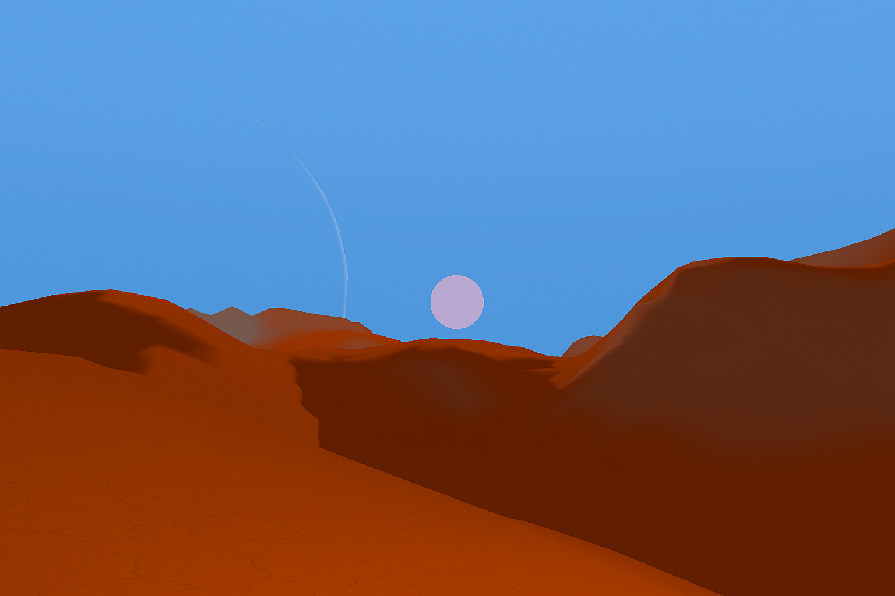
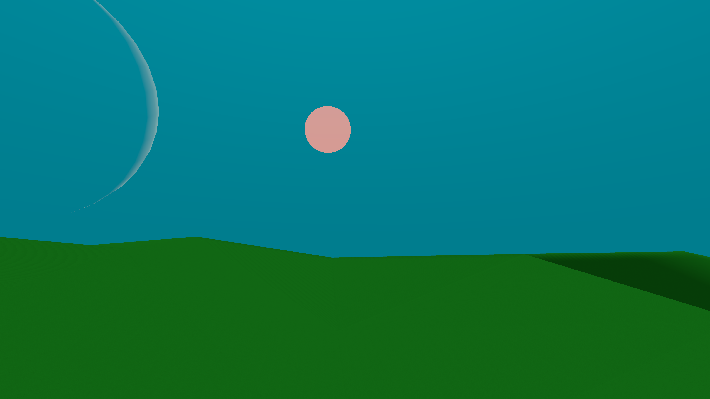
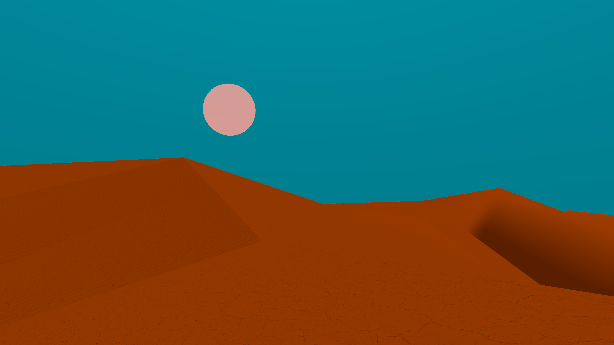

# 🌍 Planet Generator Pro

**Planet Generator Pro** is a complete Unity toolkit for creating customizable spherical planets — realistic or stylized.  
It includes atmosphere rendering, terrain shading, toon water, player gravity controllers, and orbital systems.

---

## ✨ Features
- 🌌 Atmosphere rendering – adjustable height, density, and color  
- 🏔 Terrain shading – vertex color–based system for varied surfaces  
- 🌊 Toon water – depth, foam, and color customization  
- 🛰 Orbital systems – dynamic planetary setups  
- 🧑‍🚀 Player gravity controllers – seamless gravity on spherical worlds  
- ⚡ Modular design – use only the systems you need  

---

## 🎮 Suitable For
- Sci-fi adventures  
- Space survival games  
- Exploration simulators  
- Stylized low-poly projects  

Whether you need a realistic Earth-like planet, a glowing alien world, or a prototype environment — **Planet Generator Pro** adapts to your project.  

---

## 📂 Package Contents
- Fully commented C# scripts  
- Customizable shaders  
- Demo scenes for each feature  
- Documentation & usage examples  

---

## 🚀 Quick Start
1. Import the package into your Unity project.  
2. Open one of the included demo scenes.  
3. Adjust parameters (atmosphere, water, gravity, orbit, etc.) to fit your needs.  

---

## 📸 Screenshots

  
  
  

---

## 📬 Contact
- Publisher: **MT STUDIO ASSETS**  
- Email: [tamerlan9058@gmail.com](mailto:tamerlan9058@gmail.com)

## 🌊 Procedural Infinite Ocean with Terrain

Procedural Infinite Ocean with Terrain is a modular Unity toolkit that procedurally generates an endless ocean surface with optional underwater terrain.
It provides streaming chunk-based LOD, thread-safe height generation, per-chunk materials, environment switching (above / below water), and utilities for player movement and fog. Ideal for open-world exploration, survival, and simulation projects that use the Built-in Render Pipeline (BRP).

## ✨ Key Features

Procedural infinite ocean with seamless chunk streaming and pooling

Per-chunk LOD and smooth morphing from placeholder to final mesh

Optional underwater terrain (heightmap-driven meshes) with erosion support

Thread-safe height generation (ThreadSafePerlin) for background mesh generation

Real-time sea level updates and per-chunk material properties (_ChunkWorldPos, _SeaLevel)

Trigger-driven depth fog controller with smooth restore behavior

Player-friendly systems: First-person controller with swimming/auto-submerge, FollowPlayerXZ, and ToggleByHeightWithSwap

Configurable GenGrid mesh generator with edge-fade vertex colors and foam/detail material parameters

Clean, documented C# code with no external Asset Store dependencies

Designed for Built-in Render Pipeline (BRP)

## 🎮 Suitable For

Open-world exploration and survival games

Marine or coastal environments and simulations

Games requiring large-scale water with dynamic shoreline/underwater visuals

Prototyping or production use where procedural streaming and performance matter

## 🧩 Package Contents

C# scripts (namespace ProceduralInfiniteOceanWithTerrain)

HeightMapGenerator + ThreadSafePerlin (thread-safe Perlin & fBM)

ChunkComponent (per-chunk generation, blend/morph, colliders)

ChunkManager / ChunkedOceanManager (streaming managers; one supports sea level control and flexible component discovery)

OceanChunk (lightweight chunk variant that updates material props)

GenGrid (grid mesh generator + material property pusher)

FirstPersonController (walking, jumping, swimming, auto-submerge)

FollowPlayerXZ (XZ follower with fixed Y and Rigidbody/Transform support)

ToggleByHeightWithSwap (swap objects above/below threshold)

TriggerFogPanel (trigger volume-driven fog with smooth restore)

ScreenshotCapture (utility to capture screenshots respecting aspect ratio)

Example/demo scene(s) illustrating usage and recommended settings

Default shaders/materials placeholders (shader property names are documented)

Documentation (README, quickstart, API notes)

## 🛠 Quick Start

Create an empty GameObject OceanRoot in your scene.

Add the ChunkManager component and assign your player Transform and a chunk prefab.

Create a chunk prefab containing MeshFilter, MeshRenderer, MeshCollider and the ChunkComponent (or OceanChunk if you prefer the lightweight variant). Assign an ocean material.

Add a single HeightMapGenerator GameObject (singleton) and configure noiseScale, octaves, and randomSeed.

Add TriggerFogPanel volumes where you want depth-driven fog effects.

Optionally add FirstPersonController to your player for swimming and auto-submerge behavior.

Run the scene — chunks will stream around the player automatically. Tune distances, LOD scale, and erosion parameters to balance quality and performance.

## 🔧 Important Notes & Settings

Built-in Render Pipeline only: This package uses RenderSettings fog and material workflows tailored to the built-in pipeline. For URP/HDRP, fog and volumes must be adapted (the package logs SRP detection).

Thread-safety: Heavy noise/height computations use GetHeightNormalizedThreadSafe() and ThreadSafePerlin. Mesh/Material changes always occur on the main thread.

Shader property names: The package pushes properties such as _ChunkWorldPos, _SeaLevel, _ChunkSize, and _EdgeFadeSize. Ensure your shader reads these properties or update the scripts accordingly.

Pools & performance: Managers use pooling to avoid GC churn. Tune visibleDistanceInChunks, loadDistanceInChunks, and updateInterval to fit platform performance.

Erosion & quality: erosionIterations, talusAngle, and erosionFactor increase realism but cost CPU — reduce for lower-end targets.

---

## ⚠️ AI Disclosure
Some textures and partial script assistance were created with the aid of AI tools. All content has been reviewed, tested, and integrated manually.


# 🎬 Cinematic Racing Replay System

**Cinematic Racing Replay System** is a professional Unity toolkit for recording and replaying racing gameplay with cinematic camera angles, smooth interpolation, and customizable UI effects to create broadcast-quality race replays.

---

## ✨ Features
- 🎥 Multiple cinematic camera angles – dynamic follow, orbit, track-side, and aerial views
- ⏺️ Complete race recording – capture vehicle position, rotation, and state data
- ▶️ Smooth replay playback – time control, pause, rewind, and fast-forward
- 🎞️ Interpolation system – fluid motion between recorded frames
- 📊 UI integration – replay controls, timeline scrubbing, and race statistics
- 🎨 Visual effects – motion blur, camera shake, and cinematic transitions
- 🏁 Multi-vehicle support – record and replay multiple racers simultaneously
- ⚙️ Modular architecture – easy integration with existing racing games

---

## 🎮 Suitable For
- Racing games (arcade, simulation, kart racing)
- Sports and competitive driving games
- Training and analysis tools for racing mechanics
- Content creation for trailers and promotional videos
- Esports replay systems and spectator modes

Whether you're building an arcade racer, realistic simulator, or competitive online racing game — **Cinematic Racing Replay System** delivers professional replay functionality.

---

## 📂 Package Contents
- Fully commented C# scripts
- Replay recording and playback managers
- Cinematic camera controller with multiple presets
- UI prefabs for replay controls
- Demo racing scene with sample vehicles
- Documentation & integration guide

---

## 🚀 Quick Start
1. Import the package into your Unity project
2. Add the ReplayManager component to your scene
3. Attach the ReplayRecorder script to vehicles you want to record
4. Configure camera angles using the CinematicCameraController
5. Use the included UI prefabs for playback controls
6. Press record during gameplay and review with cinematic cameras

---

## 🔧 Key Components

### Recording System
- Automatic frame capture at configurable intervals
- Efficient data storage with compression options
- Support for custom data fields (speed, gear, boost, etc.)
- Memory-efficient circular buffer for long races

### Camera System
- Dynamic follow camera with smooth tracking
- Orbit camera with adjustable radius and height
- Track-side static cameras with automatic switching
- Aerial/drone camera with smooth movements
- TV broadcast-style camera transitions
- Customizable camera shake and motion effects

### Playback Controls
- Play, pause, stop, and scrub timeline
- Variable playback speed (slow motion to fast forward)
- Frame-by-frame stepping for detailed analysis
- Loop functionality for highlight reels
- Multiple vehicle perspective switching

---

## ⚙️ Render Pipeline Compatibility

| Unity Version | Built-in | URP | HDRP |
|--------------|----------|-----|------|
| 2022.3.62f3  | ✅ Compatible | ❌ Not compatible | ❌ Not compatible |

**Note:** This package is designed for the Built-in Render Pipeline. For URP/HDRP projects, camera effects and post-processing will need adaptation.

---

## 💡 Usage Examples

### Basic Recording
```csharp
// Start recording
ReplayManager.Instance.StartRecording();

// Stop recording after race ends
ReplayManager.Instance.StopRecording();
```

### Playback Control
```csharp
// Play recorded replay
ReplayManager.Instance.PlayReplay();

// Change playback speed
ReplayManager.Instance.SetPlaybackSpeed(0.5f); // Slow motion

// Switch camera angle
CinematicCameraController.Instance.SetCameraMode(CameraMode.Orbit);
```

---

## 🎯 Integration Tips
- Works with standard Unity Rigidbody-based vehicle controllers
- Compatible with most third-party racing assets
- Easily extend recording system for custom vehicle properties
- Integrate with your existing UI framework
- Export replay data for external analysis or sharing

---

## 📬 Contact
- Publisher: **MT STUDIO ASSETS**
- Email: [tamerlan9058@gmail.com](mailto:tamerlan9058@gmail.com)

---

## ⚠️ AI Disclosure
Some textures and partial script assistance were created with the aid of AI tools. All content has been reviewed, tested, and integrated manually.

---

## 📋 Technical Requirements
- Unity 2022.3.62f3 or higher
- Built-in Render Pipeline
- .NET 4.x or higher
- Recommended: Physics timestep of 0.02 or lower for smooth recording

---

## 🔄 Version History
- **v1.0** - Initial release with core replay and camera systems


# 🧩 Procedural Jigsaw Puzzle Generator

**Procedural Jigsaw Puzzle Generator** is a complete Unity toolkit for creating fully interactive jigsaw puzzles from any image. Generate realistic puzzle pieces with authentic shapes, smooth piece movement, snap mechanics, and customizable difficulty settings.

---

## ✨ Features
- 🎲 Procedural piece generation – authentic jigsaw shapes with tabs and blanks
- 🖼️ Any image support – convert any texture into a playable puzzle
- 🎯 Smart snap mechanics – pieces automatically connect when close enough
- ✋ Intuitive controls – drag, drop, rotate, and organize pieces
- 📐 Adjustable difficulty – customize piece count, size, and complexity
- 🎨 Visual feedback – highlight valid connections and completed sections
- 🔊 Audio integration – satisfying sound effects for snapping and completion
- 📱 Multi-platform – works on desktop, mobile, and tablet devices
- 🏆 Progress tracking – save/load puzzle state and track completion time
- 🎭 Multiple puzzle modes – classic, rotation enabled, time challenge

---

## 🎮 Suitable For
- Puzzle games for all ages
- Educational apps and brain training games
- Casual mobile games
- Memory and cognitive skill development
- Photo puzzle apps
- Relaxation and mindfulness games
- Gallery and art appreciation apps

Whether you're creating a casual puzzle game, educational tool, or photo-based entertainment app — **Procedural Jigsaw Puzzle Generator** provides everything you need.

---

## 📂 Package Contents
- Fully commented C# scripts
- Procedural puzzle piece generator
- Drag and drop interaction system
- Snap detection and connection logic
- UI prefabs for puzzle interface
- Demo scenes with various puzzle configurations
- Sample puzzles and textures
- Documentation & integration guide

---

## 🚀 Quick Start
1. Import the package into your Unity project
2. Add the PuzzleGenerator component to your scene
3. Assign an image texture to the puzzle generator
4. Configure puzzle settings (piece count, difficulty)
5. Click "Generate Puzzle" to create interactive pieces
6. Run the scene and start solving!

---

## 🔧 Key Components

### Puzzle Generation System
- Procedural piece shape algorithm with authentic jigsaw patterns
- Customizable piece count (from 4 to 1000+ pieces)
- Random or fixed piece distribution
- Edge piece detection and handling
- UV mapping for accurate image display on pieces

### Interaction System
- Smooth drag and drop mechanics
- Multi-touch support for mobile devices
- Piece rotation (optional)
- Zoom and pan canvas navigation
- Piece grouping – connected pieces move together
- Visual highlighting for active pieces

### Snap Mechanics
- Proximity-based snap detection
- Configurable snap distance and tolerance
- Smooth animation when pieces connect
- Audio feedback for successful connections
- Prevention of incorrect connections

### UI Features
- Piece counter and progress display
- Timer for challenge modes
- Hint system showing reference image
- Shuffle and reset functions
- Completion celebration effects

---

## ⚙️ Customization Options

### Difficulty Settings
- **Easy**: 12-24 pieces, large size, forgiving snap distance
- **Medium**: 48-100 pieces, standard size, moderate snap
- **Hard**: 200-500 pieces, small size, precise snap required
- **Expert**: 500+ pieces, rotation enabled, tight tolerance

### Visual Options
- Piece border thickness and color
- Shadow and depth effects
- Highlight colors for selected pieces
- Background patterns or solid colors
- Preview image opacity and position

### Gameplay Options
- Enable/disable piece rotation
- Scatter pieces randomly or in grid
- Group pieces by edge/corner/interior
- Time limit challenges
- Hint system frequency

---

## 💡 Usage Examples

### Generate Basic Puzzle
```csharp
// Create puzzle from texture
PuzzleGenerator generator = GetComponent<PuzzleGenerator>();
generator.sourceImage = myTexture;
generator.pieceCount = 48;
generator.GeneratePuzzle();
```

### Custom Snap Settings
```csharp
// Configure snap behavior
SnapController snapController = GetComponent<SnapController>();
snapController.snapDistance = 50f;
snapController.snapSpeed = 0.3f;
snapController.playSnapSound = true;
```

### Track Progress
```csharp
// Monitor completion
PuzzleManager.OnPieceConnected += UpdateProgress;
PuzzleManager.OnPuzzleComplete += ShowVictory;

void UpdateProgress(int connectedPieces, int totalPieces)
{
    float progress = (float)connectedPieces / totalPieces * 100f;
    Debug.Log($"Puzzle {progress:F1}% complete");
}
```

---

## 🎯 Integration Tips
- Use high-resolution images (1024x1024 or larger) for best quality
- Adjust piece count based on target platform performance
- Enable object pooling for puzzles with many pieces
- Implement save system using included serialization helpers
- Combine with your own UI framework seamlessly
- Add custom piece shapes using the extensible shape system

---

## 📱 Platform Optimization

### Mobile Devices
- Recommended 20-100 pieces for optimal performance
- Touch-optimized controls with gesture support
- Reduced shadow and effect quality for better FPS
- Automatic piece scaling for various screen sizes

### Desktop
- Support for 200+ pieces with high visual quality
- Mouse drag with smooth interpolation
- Keyboard shortcuts for rotation and zoom
- Multi-monitor support for large puzzles

---

## 🎨 Art Style Support
- Realistic photo puzzles
- Cartoon and illustrated images
- Abstract and pattern-based designs
- Custom piece shapes (rounded, geometric, artistic)
- Themed borders and backgrounds

---

## 📸 Screenshots


---

## 📬 Contact
- Publisher: **MT STUDIO ASSETS**
- Email: [tamerlan9058@gmail.com](mailto:tamerlan9058@gmail.com)

---

## 📋 Technical Requirements
- Unity 2022.3.62 or higher
- Built-in Render Pipeline (URP/HDRP support available)
- .NET 4.x or higher
- Minimum 2GB RAM for complex puzzles
- Supports Windows, macOS, Linux, iOS, Android, WebGL

---

## ⚠️ AI Disclosure
Some textures and partial script assistance were created with the aid of AI tools. All content has been reviewed, tested, and integrated manually.

---

## 🔄 Version History
- **v1.0** (Dec 29, 2025) - Initial release with core puzzle generation and interaction systems

---

## 💡 Tips for Best Results
- Start with medium-sized puzzles (48-100 pieces) to test settings
- Use images with clear details and varied colors for easier solving
- Enable snap sound effects for better user feedback
- Test snap distance on your target devices
- Consider adding a "preview" mode for difficult puzzles
- Save progress automatically to prevent user frustration
