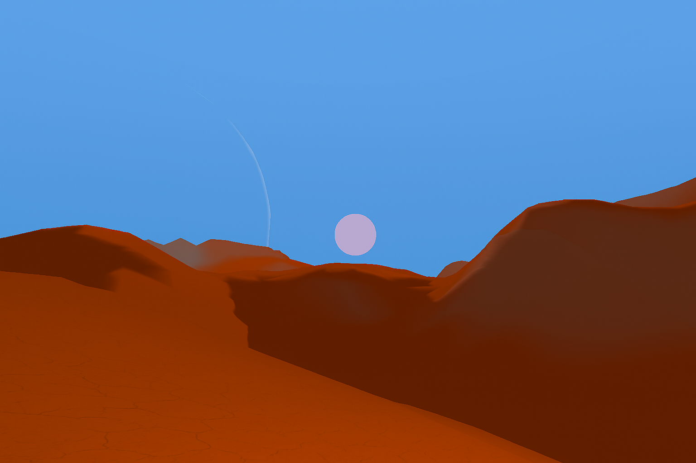
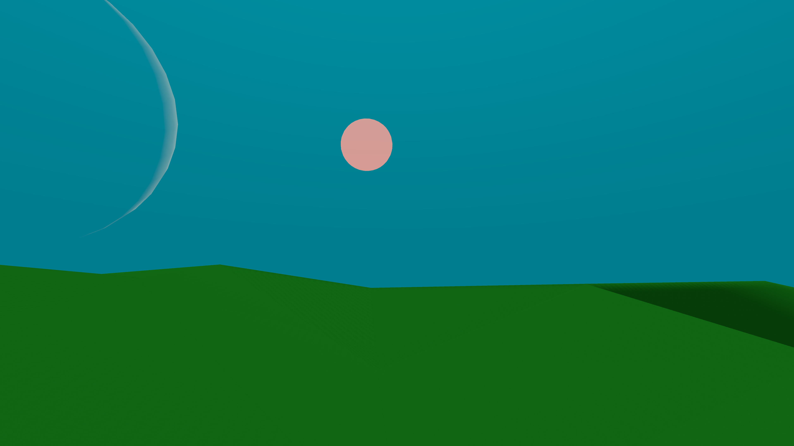
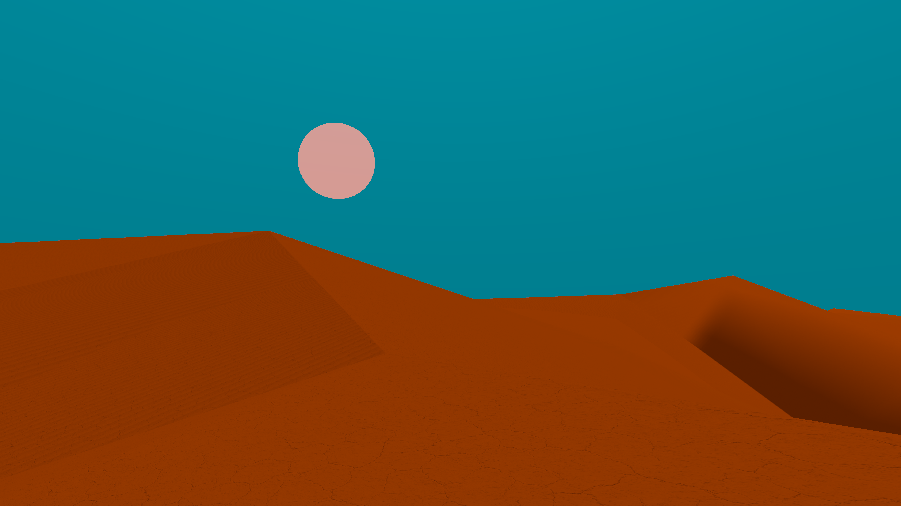

<div align="center">

# 🎮 MT STUDIO ASSETS
### Professional Unity Asset Collection

[](https://unity.com/)
[](mailto:tamerlan9058@gmail.com)
[](#)
[](mailto:tamerlan9058@gmail.com)

---

*High-quality Unity toolkits for game developers*

[🌐 Explore Assets](#-our-assets) • [📧 Contact](mailto:tamerlan9058@gmail.com) • [📖 Documentation](#-documentation)

</div>

---

## 📦 Asset Catalog

| # | Asset | Category |
|:-:|:------|:---------|
| 1 | 🌍 [Planet Generator Pro](#-planet-generator-pro) | Terrain / Space |
| 2 | 🌊 [Procedural Infinite Ocean with Terrain](#-procedural-infinite-ocean-with-terrain) | Terrain / Ocean |
| 3 | 🏝️ [ProceduralScape (TerrainForge)](#️-proceduralscape-terrainforge) | Terrain / Islands |
| 4 | 🎬 [Cinematic Racing Replay System](#-cinematic-racing-replay-system) | Gameplay / Tools |
| 5 | 🧩 [Procedural Jigsaw Puzzle Generator](#-procedural-jigsaw-puzzle-generator) | Gameplay / Puzzle |
| 6 | 🕹️ [PuzzleCraft Pro](#️-puzzlecraft-pro--complete-jigsaw-puzzle-game) | Gameplay / Puzzle |
| 7 | 🧱 [Voxel Sandbox System](#-voxel-sandbox-system) | Gameplay / Sandbox |
| 8 | 📱 [Voxel Sandbox System — Mobile Edition](#-voxel-sandbox-system--mobile-edition) | Gameplay / Mobile |

---

## 🌟 About

**MT STUDIO ASSETS** is a collection of professional, production-ready Unity toolkits designed to accelerate game development. Each asset is built with **modularity**, **performance**, and **ease of integration** in mind.

> 💡 **Our Philosophy**: Provide developers with robust, well-documented tools that work out of the box while remaining highly customizable.

---

## 🎯 Our Assets

### 🌍 Planet Generator Pro

**Planet Generator Pro** is a complete Unity toolkit for creating customizable spherical planets — realistic or stylized. It includes atmosphere rendering, terrain shading, toon water, player gravity controllers, and orbital systems.

#### ✨ Features
- 🌌 Atmosphere rendering – adjustable height, density, and color  
- 🏔 Terrain shading – vertex color–based system for varied surfaces  
- 🌊 Toon water – depth, foam, and color customization  
- 🛰 Orbital systems – dynamic planetary setups  
- 🧑‍🚀 Player gravity controllers – seamless gravity on spherical worlds  
- ⚡ Modular design – use only the systems you need  

#### 🎮 Suitable For
- Sci-fi adventures  
- Space survival games  
- Exploration simulators  
- Stylized low-poly projects  

Whether you need a realistic Earth-like planet, a glowing alien world, or a prototype environment — **Planet Generator Pro** adapts to your project.

#### 📂 Package Contents
- Fully commented C# scripts  
- Customizable shaders  
- Demo scenes for each feature  
- Documentation & usage examples  

#### 🚀 Quick Start
1. Import the package into your Unity project.  
2. Open one of the included demo scenes.  
3. Adjust parameters (atmosphere, water, gravity, orbit, etc.) to fit your needs.  

#### 📸 Screenshots

  
  


---

### 🌊 Procedural Infinite Ocean with Terrain

**Procedural Infinite Ocean with Terrain** is a modular Unity toolkit that procedurally generates an endless ocean surface with optional underwater terrain. It provides streaming chunk-based LOD, thread-safe height generation, per-chunk materials, environment switching (above / below water), and utilities for player movement and fog. Ideal for open-world exploration, survival, and simulation projects that use the Built-in Render Pipeline (BRP).

#### ✨ Key Features

- Procedural infinite ocean with seamless chunk streaming and pooling
- Per-chunk LOD and smooth morphing from placeholder to final mesh
- Optional underwater terrain (heightmap-driven meshes) with erosion support
- Thread-safe height generation (ThreadSafePerlin) for background mesh generation
- Real-time sea level updates and per-chunk material properties (_ChunkWorldPos, _SeaLevel)
- Trigger-driven depth fog controller with smooth restore behavior
- Player-friendly systems: First-person controller with swimming/auto-submerge, FollowPlayerXZ, and ToggleByHeightWithSwap
- Configurable GenGrid mesh generator with edge-fade vertex colors and foam/detail material parameters
- Clean, documented C# code with no external Asset Store dependencies
- Designed for Built-in Render Pipeline (BRP)

#### 🎮 Suitable For

- Open-world exploration and survival games
- Marine or coastal environments and simulations
- Games requiring large-scale water with dynamic shoreline/underwater visuals
- Prototyping or production use where procedural streaming and performance matter

#### 🧩 Package Contents

- C# scripts (namespace ProceduralInfiniteOceanWithTerrain)
- HeightMapGenerator + ThreadSafePerlin (thread-safe Perlin & fBM)
- ChunkComponent (per-chunk generation, blend/morph, colliders)
- ChunkManager / ChunkedOceanManager (streaming managers; one supports sea level control and flexible component discovery)
- OceanChunk (lightweight chunk variant that updates material props)
- GenGrid (grid mesh generator + material property pusher)
- FirstPersonController (walking, jumping, swimming, auto-submerge)
- FollowPlayerXZ (XZ follower with fixed Y and Rigidbody/Transform support)
- ToggleByHeightWithSwap (swap objects above/below threshold)
- TriggerFogPanel (trigger volume-driven fog with smooth restore)
- ScreenshotCapture (utility to capture screenshots respecting aspect ratio)
- Example/demo scene(s) illustrating usage and recommended settings
- Default shaders/materials placeholders (shader property names are documented)
- Documentation (README, quickstart, API notes)

#### 🛠 Quick Start

1. Create an empty GameObject OceanRoot in your scene.
2. Add the ChunkManager component and assign your player Transform and a chunk prefab.
3. Create a chunk prefab containing MeshFilter, MeshRenderer, MeshCollider and the ChunkComponent (or OceanChunk if you prefer the lightweight variant). Assign an ocean material.
4. Add a single HeightMapGenerator GameObject (singleton) and configure noiseScale, octaves, and randomSeed.
5. Add TriggerFogPanel volumes where you want depth-driven fog effects.
6. Optionally add FirstPersonController to your player for swimming and auto-submerge behavior.
7. Run the scene — chunks will stream around the player automatically. Tune distances, LOD scale, and erosion parameters to balance quality and performance.

#### 🔧 Important Notes & Settings

**Built-in Render Pipeline only**: This package uses RenderSettings fog and material workflows tailored to the built-in pipeline. For URP/HDRP, fog and volumes must be adapted (the package logs SRP detection).

**Thread-safety**: Heavy noise/height computations use GetHeightNormalizedThreadSafe() and ThreadSafePerlin. Mesh/Material changes always occur on the main thread.

**Shader property names**: The package pushes properties such as _ChunkWorldPos, _SeaLevel, _ChunkSize, and _EdgeFadeSize. Ensure your shader reads these properties or update the scripts accordingly.

**Pools & performance**: Managers use pooling to avoid GC churn. Tune visibleDistanceInChunks, loadDistanceInChunks, and updateInterval to fit platform performance.

**Erosion & quality**: erosionIterations, talusAngle, and erosionFactor increase realism but cost CPU — reduce for lower-end targets.

---

### 🏝️ ProceduralScape (TerrainForge)

**ProceduralScape** is a complete Unity toolkit (codename **TerrainForge**) for building stylized procedural islands and terrains — combining heightmap-driven terrain generation, island masking, vegetation systems (trees & grass), a Gerstner-wave water plane, and a full day/night sky in one cohesive package.

#### ✨ Key Features

- 🗺️ **Procedural terrain generation** – multi-chunk heightmap terrain with customizable seed, chunk count, and auto-update in editor
- 🏝️ **Island masking** – `Organic` (noise-based) and `Continent` (jagged coastline) island shapes with adjustable size and coastal falloff
- 🌊 **Realistic Gerstner-wave water plane** – configurable resolution, amplitude, wavelength, with auto-resolution and a dedicated `RealisticWater` shader
- 🌫️ **Underwater effect** – screen-space underwater overlay panel triggered by camera depth, with hysteresis to prevent flicker
- 🌲 **Tree system** – `TreeSpawner` + `TreeMeshBuilder` with three built-in shape templates (Deciduous, Pine, Bush), procedural billboard sprite generation, and `TreeLODManager` for distance-based mesh → billboard switching and culling
- 🌿 **Grass system** – cell-based `GrassSpawner` (4×4 grid per chunk) with distance culling via renderer toggling, billboard textures, or custom prefabs
- ☀️ **Procedural sky & sun** – `ProceduralSky` (zenith/horizon/sunset colors, fog control), `SunController` (manual or automatic day/night cycle), and `SunDisc` (camera-facing sun quad with occlusion)
- 🎨 **Layered terrain shading** – `TerrainSplat` shader with up to 8 height/slope-blended texture layers, or vertex-color fallback when no textures are assigned
- 🧗 **Slope-based rock coloring & domain warping** – `RealisticSettings` add natural-looking cliffs and organic noise distortion
- 🚶 **First-person player controller** – WASD movement, mouse look, sprint, jump, cursor lock
- ⚙️ **ScriptableObject profiles** – `TerrainProfile`, `TreeProfile`, `GrassProfile` for fully data-driven, reusable configurations
- 🧩 **Shader build-safety** – `TerrainShaderIncluder` component prevents Unity from stripping procedural shaders from builds

#### 🎮 Suitable For

- Stylized exploration and survival games
- Island/archipelago-based open worlds
- Sailing, fishing, and coastal simulation games
- Low-poly adventure and prototyping projects
- Educational or showcase scenes for procedural generation techniques

#### 📂 Package Contents

- C# scripts (namespace `TerrainForge`): terrain, island mask, noise, water, sky, sun, trees, grass, mesh builder, material builder, player controller
- Custom shaders: `TerrainSplat`, `VertexColor`, `RealisticWater`, `Grass`, `TreeLit`, `TreeBillboard`, `ProceduralSky`, `SunDisc`
- Editor scripts: custom inspectors for terrain, water, tree spawner, and first-person player
- Tree textures (diffuse, normal/specular, translucency/gloss, shadow, bush, grass, tree sprites)
- ScriptableObject profile assets folder (`Profiles`)
- Demo scene (`DEMO.unity`)
- PDF documentation (`TerrainForge_Documentation.pdf`)

#### 🚀 Quick Start

1. Import the package into your Unity project.
2. Open the `DEMO.unity` scene to see a fully configured example.
3. Create or assign `TerrainProfile`, `TreeProfile`, and `GrassProfile` assets via `ProceduralTerrain/...` in the Create menu.
4. Add a `ProceduralTerrainGenerator` to an empty GameObject, assign your profile, and set seed/chunk count.
5. Configure island mode (`Organic`/`Continent`) if you want a bounded landmass instead of infinite terrain.
6. Add `TerrainShaderIncluder` to a scene object and drag in all procedural shaders to ensure they aren't stripped from builds.
7. Tune the `WaterPlane`, `ProceduralSky`, and `SunController` components to match your art direction.

#### 🔧 Important Notes & Settings

**Build-in shaders must be referenced**: Without `TerrainShaderIncluder` in the scene, Unity may strip unused shaders during build, causing pink/white materials.

**D3D11 compatibility**: The `TerrainSplat` shader uses fixed `_H0.._H7` / `_B0.._B7` properties instead of arrays, since dynamic indexing isn't supported on all platforms.

**LOD & culling**: `TreeLODManager` switches between 3D mesh and billboard based on distance to the nearest tree-cluster bounds (important for large chunks), while `GrassSpawner` uses simple renderer-enable toggling per cell for distance culling.

**Editor-time generation**: `ProceduralTerrainGenerator` and `ProceduralSky` support `[ExecuteAlways]`/editor auto-update, so terrain and sky settings can be previewed without entering Play mode.

---

### 🎬 Cinematic Racing Replay System

**Cinematic Racing Replay System** is a professional Unity toolkit for recording and replaying racing gameplay with cinematic camera angles, smooth interpolation, and customizable UI effects to create broadcast-quality race replays.

#### ✨ Features
- 🎥 Multiple cinematic camera angles – dynamic follow, orbit, track-side, and aerial views
- ⏺️ Complete race recording – capture vehicle position, rotation, and state data
- ▶️ Smooth replay playback – time control, pause, rewind, and fast-forward
- 🎞️ Interpolation system – fluid motion between recorded frames
- 📊 UI integration – replay controls, timeline scrubbing, and race statistics
- 🎨 Visual effects – motion blur, camera shake, and cinematic transitions
- 🏁 Multi-vehicle support – record and replay multiple racers simultaneously
- ⚙️ Modular architecture – easy integration with existing racing games

#### 🎮 Suitable For
- Racing games (arcade, simulation, kart racing)
- Sports and competitive driving games
- Training and analysis tools for racing mechanics
- Content creation for trailers and promotional videos
- Esports replay systems and spectator modes

Whether you're building an arcade racer, realistic simulator, or competitive online racing game — **Cinematic Racing Replay System** delivers professional replay functionality.

#### 📂 Package Contents
- Fully commented C# scripts
- Replay recording and playback managers
- Cinematic camera controller with multiple presets
- UI prefabs for replay controls
- Demo racing scene with sample vehicles
- Documentation & integration guide

#### 🚀 Quick Start
1. Import the package into your Unity project
2. Add the ReplayManager component to your scene
3. Attach the ReplayRecorder script to vehicles you want to record
4. Configure camera angles using the CinematicCameraController
5. Use the included UI prefabs for playback controls
6. Press record during gameplay and review with cinematic cameras

#### 🔧 Key Components

**Recording System**
- Automatic frame capture at configurable intervals
- Efficient data storage with compression options
- Support for custom data fields (speed, gear, boost, etc.)
- Memory-efficient circular buffer for long races

**Camera System**
- Dynamic follow camera with smooth tracking
- Orbit camera with adjustable radius and height
- Track-side static cameras with automatic switching
- Aerial/drone camera with smooth movements
- TV broadcast-style camera transitions
- Customizable camera shake and motion effects

**Playback Controls**
- Play, pause, stop, and scrub timeline
- Variable playback speed (slow motion to fast forward)
- Frame-by-frame stepping for detailed analysis
- Loop functionality for highlight reels
- Multiple vehicle perspective switching

#### ⚙️ Render Pipeline Compatibility

| Unity Version | Built-in | URP | HDRP |
|--------------|----------|-----|------|
| 2022.3.62f3  | ✅ Compatible | ❌ Not compatible | ❌ Not compatible |

**Note:** This package is designed for the Built-in Render Pipeline. For URP/HDRP projects, camera effects and post-processing will need adaptation.

#### 💡 Usage Examples

**Basic Recording**
```csharp
// Start recording
ReplayManager.Instance.StartRecording();

// Stop recording after race ends
ReplayManager.Instance.StopRecording();
```

**Playback Control**
```csharp
// Play recorded replay
ReplayManager.Instance.PlayReplay();

// Change playback speed
ReplayManager.Instance.SetPlaybackSpeed(0.5f); // Slow motion

// Switch camera angle
CinematicCameraController.Instance.SetCameraMode(CameraMode.Orbit);
```

#### 🎯 Integration Tips
- Works with standard Unity Rigidbody-based vehicle controllers
- Compatible with most third-party racing assets
- Easily extend recording system for custom vehicle properties
- Integrate with your existing UI framework
- Export replay data for external analysis or sharing

#### 📋 Technical Requirements
- Unity 2022.3.62f3 or higher
- Built-in Render Pipeline
- .NET 4.x or higher
- Recommended: Physics timestep of 0.02 or lower for smooth recording

#### 🔄 Version History
- **v1.0** - Initial release with core replay and camera systems

---

### 🧩 Procedural Jigsaw Puzzle Generator

**Procedural Jigsaw Puzzle Generator** is a complete Unity toolkit for creating fully interactive jigsaw puzzles from any image. Generate realistic puzzle pieces with authentic shapes, smooth piece movement, snap mechanics, and customizable difficulty settings.

#### ✨ Features
- 🎲 Procedural piece generation – authentic jigsaw shapes with tabs and blanks
- 🖼️ Any image support – convert any texture into a playable puzzle
- 🎯 Smart snap mechanics – pieces automatically connect when close enough
- ✋ Intuitive controls – drag, drop, rotate, and organize pieces
- 📐 Adjustable difficulty – customize piece count, size, and complexity
- 🎨 Visual feedback – highlight valid connections and completed sections
- 🔊 Audio integration – satisfying sound effects for snapping and completion
- 📱 Multi-platform – works on desktop, mobile, and tablet devices
- 🏆 Progress tracking – save/load puzzle state and track completion time
- 🎭 Multiple puzzle modes – classic, rotation enabled, time challenge

#### 🎮 Suitable For
- Puzzle games for all ages
- Educational apps and brain training games
- Casual mobile games
- Memory and cognitive skill development
- Photo puzzle apps
- Relaxation and mindfulness games
- Gallery and art appreciation apps

Whether you're creating a casual puzzle game, educational tool, or photo-based entertainment app — **Procedural Jigsaw Puzzle Generator** provides everything you need.

#### 📂 Package Contents
- Fully commented C# scripts
- Procedural puzzle piece generator
- Drag and drop interaction system
- Snap detection and connection logic
- UI prefabs for puzzle interface
- Demo scenes with various puzzle configurations
- Sample puzzles and textures
- Documentation & integration guide

#### 🚀 Quick Start
1. Import the package into your Unity project
2. Add the PuzzleGenerator component to your scene
3. Assign an image texture to the puzzle generator
4. Configure puzzle settings (piece count, difficulty)
5. Click "Generate Puzzle" to create interactive pieces
6. Run the scene and start solving!

#### 🔧 Key Components

**Puzzle Generation System**
- Procedural piece shape algorithm with authentic jigsaw patterns
- Customizable piece count (from 4 to 1000+ pieces)
- Random or fixed piece distribution
- Edge piece detection and handling
- UV mapping for accurate image display on pieces

**Interaction System**
- Smooth drag and drop mechanics
- Multi-touch support for mobile devices
- Piece rotation (optional)
- Zoom and pan canvas navigation
- Piece grouping – connected pieces move together
- Visual highlighting for active pieces

**Snap Mechanics**
- Proximity-based snap detection
- Configurable snap distance and tolerance
- Smooth animation when pieces connect
- Audio feedback for successful connections
- Prevention of incorrect connections

**UI Features**
- Piece counter and progress display
- Timer for challenge modes
- Hint system showing reference image
- Shuffle and reset functions
- Completion celebration effects

#### ⚙️ Customization Options

**Difficulty Settings**
- **Easy**: 12-24 pieces, large size, forgiving snap distance
- **Medium**: 48-100 pieces, standard size, moderate snap
- **Hard**: 200-500 pieces, small size, precise snap required
- **Expert**: 500+ pieces, rotation enabled, tight tolerance

**Visual Options**
- Piece border thickness and color
- Shadow and depth effects
- Highlight colors for selected pieces
- Background patterns or solid colors
- Preview image opacity and position

**Gameplay Options**
- Enable/disable piece rotation
- Scatter pieces randomly or in grid
- Group pieces by edge/corner/interior
- Time limit challenges
- Hint system frequency

#### 💡 Usage Examples

**Generate Basic Puzzle**
```csharp
// Create puzzle from texture
PuzzleGenerator generator = GetComponent<PuzzleGenerator>();
generator.sourceImage = myTexture;
generator.pieceCount = 48;
generator.GeneratePuzzle();
```

**Custom Snap Settings**
```csharp
// Configure snap behavior
SnapController snapController = GetComponent<SnapController>();
snapController.snapDistance = 50f;
snapController.snapSpeed = 0.3f;
snapController.playSnapSound = true;
```

**Track Progress**
```csharp
// Monitor completion
PuzzleManager.OnPieceConnected += UpdateProgress;
PuzzleManager.OnPuzzleComplete += ShowVictory;

void UpdateProgress(int connectedPieces, int totalPieces)
{
    float progress = (float)connectedPieces / totalPieces * 100f;
    Debug.Log($"Puzzle {progress:F1}% complete");
}
```

#### 🎯 Integration Tips
- Use high-resolution images (1024x1024 or larger) for best quality
- Adjust piece count based on target platform performance
- Enable object pooling for puzzles with many pieces
- Implement save system using included serialization helpers
- Combine with your own UI framework seamlessly
- Add custom piece shapes using the extensible shape system

#### 📱 Platform Optimization

**Mobile Devices**
- Recommended 20-100 pieces for optimal performance
- Touch-optimized controls with gesture support
- Reduced shadow and effect quality for better FPS
- Automatic piece scaling for various screen sizes

**Desktop**
- Support for 200+ pieces with high visual quality
- Mouse drag with smooth interpolation
- Keyboard shortcuts for rotation and zoom
- Multi-monitor support for large puzzles

#### 🎨 Art Style Support
- Realistic photo puzzles
- Cartoon and illustrated images
- Abstract and pattern-based designs
- Custom piece shapes (rounded, geometric, artistic)
- Themed borders and backgrounds

#### 📋 Technical Requirements
- Unity 2022.3.62 or higher
- Built-in Render Pipeline (URP/HDRP support available)
- .NET 4.x or higher
- Minimum 2GB RAM for complex puzzles
- Supports Windows, macOS, Linux, iOS, Android, WebGL

#### 🔄 Version History
- **v1.0** (Dec 29, 2025) - Initial release with core puzzle generation and interaction systems

#### 💡 Tips for Best Results
- Start with medium-sized puzzles (48-100 pieces) to test settings
- Use images with clear details and varied colors for easier solving
- Enable snap sound effects for better user feedback
- Test snap distance on your target devices
- Consider adding a "preview" mode for difficult puzzles
- Save progress automatically to prevent user frustration

---

### 🕹️ PuzzleCraft Pro — Complete Jigsaw Puzzle Game

**PuzzleCraft Pro** is a fully featured jigsaw puzzle game template for Unity — not just a generator, but a complete, shippable game experience with menus, save system, gallery import, and polished UI, ready for mobile and desktop release.

#### ✨ Key Features

- 🧩 **Complete Game Template** – Full game loop with main menu, puzzle selection, gameplay, and completion screens — ship it as-is or customize to fit your brand
- 📷 **Generate Puzzles from Photos** – Create puzzles from any image, including photos imported at runtime from the device gallery
- 🖼️ **Gallery Import** – Native device gallery access on Android and iOS for player-sourced puzzle images
- 💾 **Save & Continue** – Automatic progress saving; players can close the app and resume exactly where they left off
- 🎯 **Multiple Difficulty Levels** – Configurable piece counts for easy, medium, hard, and expert sessions
- 📱 **Mobile & Desktop Ready** – Optimized for Android, iOS, and PC; touch and mouse input handled transparently
- 🔍 **Zoom & Pan Controls** – Smooth pinch-to-zoom and pan for comfortable play on any screen size
- 💡 **Hint System** – Semi-transparent reference image overlay to help players when stuck
- 🎨 **Clean UI Included** – Polished, ready-to-use interface — no custom UI work required
- ⚡ **Lightweight Package** – Minimal footprint and fast integration into new or existing projects

#### 🎮 Suitable For

- Casual mobile puzzle games
- Photo-based puzzle apps
- Relaxation and mindfulness games
- Educational apps for all ages
- Gallery and art appreciation experiences
- Developers who want a complete, ready-to-ship puzzle game

#### 📂 Package Contents

- Fully commented C# scripts
- Complete game scene hierarchy (menu, game, results)
- Gallery import system for Android & iOS
- Save/load serialization system
- Difficulty configuration assets
- Zoom & pan canvas controller
- Hint overlay system
- Polished UI prefabs and layouts
- Demo scene with sample puzzles
- Documentation & integration guide

#### 🚀 Quick Start

1. Import the package into your Unity project
2. Open the included demo scene to see a complete working example
3. Assign your app icon and branding assets
4. Configure difficulty presets in the inspector
5. Build and deploy — the game is ready to ship

#### 🔧 Key Components

**Game Flow**
- Main menu with puzzle gallery browser
- In-game UI: piece counter, timer, difficulty badge
- Completion screen with time, stars, and share prompt
- Persistent player progress across sessions

**Gallery Import System**
- Native Android and iOS gallery picker integration
- Runtime texture loading and puzzle generation from user photos
- Aspect ratio handling and texture compression

**Save System**
- Automatic slot-based saving of piece positions and group state
- Resume any puzzle from the exact state it was left in
- Multiple concurrent save slots supported

**Zoom & Pan**
- Smooth pinch-to-zoom with configurable min/max scale
- Inertia-based panning for natural feel
- Double-tap to fit puzzle in view

#### ⚙️ Difficulty Presets

| Level | Pieces | Snap Distance | Rotation |
|:-----:|:------:|:-------------:|:--------:|
| Easy | 12–24 | Generous | Off |
| Medium | 48–100 | Standard | Off |
| Hard | 150–300 | Tight | Optional |
| Expert | 300+ | Precise | On |

#### 📋 Technical Requirements

- Unity 2022.3 LTS or higher
- Built-in Render Pipeline (URP/HDRP adaptable)
- .NET 4.x or higher
- Android API 21+ / iOS 12+
- Supports Windows, macOS, Linux, iOS, Android, WebGL

#### 🔄 Version History

- **v1.0** – Initial release: complete game template, gallery import, save system, zoom & pan, hint system, difficulty levels

---

### 🧱 Voxel Sandbox System

**Voxel Sandbox System** is a ready-to-use Unity toolkit for creating fully interactive voxel-based worlds in sandbox and survival-style games. It allows you to quickly launch a project featuring procedural worlds, block building and destruction, and dynamic water interaction — without developing core systems from scratch.

#### ✨ Key Features

- 🌍 **Procedural voxel worlds** – Automatic terrain generation with mountains, plains, water bodies, and vegetation
- 🧱 **Classic sandbox building** – Real-time block placement and destruction
- 💧 **Dynamic water behavior** – Water naturally fills space, flows, and reacts to changes in the world
- 🎮 **Familiar controls** – Intuitive controls inspired by popular voxel games
- 🎒 **Inventory & hotbar system** – Quick access to blocks and items
- 🎨 **Multi-face block visuals** – Support for different textures on each side of a block
- ⚡ **Optimized performance** – Suitable for large worlds and long play sessions
- 🧩 **Modular design** – Easy to extend and adapt to your game ideas

#### 🎮 Suitable For

- Sandbox and survival games  
- Minecraft-like voxel projects  
- Gameplay prototyping  
- Educational projects  
- Building and destruction simulators  
- Indie games with procedural worlds  

#### 🚀 What You Can Create

- Explorable voxel worlds  
- Resource gathering and building games  
- Interactive environments  
- Creativity-focused gameplay experiences  
- A foundation for survival mechanics *(crafting, biomes, world progression)*

#### 📦 Package Contents

- Fully functional sandbox system  
- Procedural world generator  
- Block interaction system  
- Inventory and hotbar UI  
- Water and environment interaction support  
- Customizable visual materials  
- Demo scene for quick start  
- Setup and usage documentation  

#### ⚙️ Customization Options

- World size and complexity  
- Object and environment density  
- Water behavior settings  
- Available block sets  
- Block visual style  
- Interaction and difficulty balance  

All key parameters can be adjusted without modifying the source code.

#### 🖥️ Platform Support

- Windows  
- macOS  
- Linux  
- Android  
- iOS  
- WebGL  

Suitable for both desktop and mobile projects.

#### 🛠️ Technical Requirements

- Unity 2022.3 LTS or newer  
- Built-in Render Pipeline  
- .NET 4.x  
- No third-party packages required  

#### 🔄 Version History

- **v1.0** — Initial release  
  - Core sandbox mechanics  
  - Procedural world generation  
  - Voxel building system  
  - Interactive water behavior

---

### 📱 Voxel Sandbox System — Mobile Edition

**Voxel Sandbox System — Mobile Edition** is a mobile-optimized version of the Voxel Sandbox System, featuring touch controls, mobile UI, and performance optimizations specifically designed for iOS and Android devices. Build Minecraft-style games that run smoothly on mobile platforms with intuitive touch-based interactions.

#### ✨ Key Features

- 📱 **Touch-optimized controls** – Virtual joystick with multiple modes (Fixed, Floating, Dynamic)
- 👆 **Mobile block interaction** – Touch-and-hold to break blocks, tap to place, swipe to look around
- 🎯 **Visual break feedback** – Progressive crack overlay and circular progress indicator
- 💾 **Complete save system** – World saving/loading with block modifications and player position
- 🎨 **Block hardness system** – Different blocks require different break times
- 🏊 **Swimming mechanics** – Smooth swimming with auto-submerge and water effects
- ⚙️ **In-game settings** – Graphics quality, render distance, and joystick mode configuration
- 🎮 **Main menu system** – Create new worlds or load existing saves
- 📊 **Inventory management** – Hotbar and full inventory with touch-friendly UI
- 🌊 **Water visual effects** – Water overlay panel when player head is submerged

#### 🎮 Mobile Input Features

**Joystick Modes:**
- **Fixed** – Joystick stays in one position
- **Fixed Floating** – Joystick appears where you touch and stays there
- **Float** – Joystick follows your finger movement
- **Dynamic** – Joystick repositions based on touch input

**Block Interaction:**
- **Tap** – Place block (right side of screen)
- **Hold** – Break block with progressive feedback
- **Swipe** – Camera look/rotation
- **Visual Feedback** – Break progress circle and crack overlay

#### 📂 Core Components

**Input & Interaction:**
- `MobileInputManager.cs` – Virtual joystick system with configurable modes
- `MobileBlockInteraction.cs` – Touch-based block placement and breaking
- `BlockBreakOverlay.cs` – Visual crack effect during block breaking
- `BlockHardness.cs` – Database of block break times

**Player & Movement:**
- `PlayerController.cs` – Character movement with swimming support
- Automatic swimming when in water
- Sprint functionality (auto-run forward when sprint held)
- Camera look system integrated with touch controls

**World & Save System:**
- `WorldGenerator.cs` – Procedural world generation
- `WorldSaveManager.cs` – Complete save/load system with loading screen
- `WorldData.cs` – World configuration data
- `SaveSystem.cs` – File I/O for world saves

**UI & Menus:**
- `MainMenuManager.cs` – Create world or load saves
- `SettingsManager.cs` – Graphics and joystick settings
- `InventoryManager.cs` – Touch-friendly inventory system
- Loading screen with progress bar
- Status messages and UI feedback

#### 🎯 Mobile Optimizations

- **Performance tuning** – Adjustable render distance and quality settings
- **Touch zones** – Screen split into movement (left) and look/interact (right) zones
- **UI scaling** – Responsive UI elements for various screen sizes
- **Memory management** – Efficient chunk loading and unloading
- **Battery considerations** – Optimized update loops and draw calls

#### 💡 Usage Examples

**Configure Joystick Mode**
```csharp
// Set joystick mode programmatically
MobileInputManager inputManager = FindObjectOfType<MobileInputManager>();
inputManager.SetMode(MobileInputManager.JoystickMode.Float);
```

**Handle Block Breaking**
```csharp
// Block breaking is automatic via touch input
// Configure break duration and hardness in inspector
BlockHardnessDatabase.GetHardness(BlockType.Stone); // Returns 1.2f
```

**Save and Load**
```csharp
// Save current world
WorldSaveManager saveManager = FindObjectOfType<WorldSaveManager>();
saveManager.SaveWorld();

// Load existing world (set before scene load)
WorldData.WorldName = "My World";
WorldData.Seed = 12345;
WorldData.LoadFromSave = true;
SceneManager.LoadScene("GameScene");
```

#### 🎨 Customization Options

**Graphics Settings:**
- Quality levels (Low, Medium, High)
- Render distance (2-16 chunks)
- Real-time adjustments in-game

**Controls Settings:**
- Joystick mode selection
- Look sensitivity adjustment
- Touch zone configuration
- Break activation delay

**Gameplay Settings:**
- Block hardness values
- Break duration multipliers
- Player movement speeds
- Swimming parameters

#### 📱 Platform Support

- ✅ **Android** – Primary target platform
- ✅ **iOS** – Full support
- ✅ **Windows/macOS** – Editor testing with mouse simulation
- ⚠️ **WebGL** – Works but touch controls may need browser-specific adjustments

#### 🛠️ Technical Requirements

- Unity 2022.3 LTS or newer
- Built-in Render Pipeline
- .NET 4.x
- Minimum Android API level 21 (Android 5.0)
- Minimum iOS 11.0
- Recommended 2GB+ RAM on mobile devices

#### 📋 Integration Tips

- **Desktop testing** – Enable `editorMouseLook` in MobileBlockInteraction for mouse testing
- **Script execution order** – Set WorldDataApplier to execute before WorldGenerator
- **Touch zones** – Adjust `rightZoneFraction` to balance movement vs interaction area
- **Performance** – Start with lower render distance on older devices
- **UI layout** – Test on multiple screen resolutions and aspect ratios

#### 🔄 Version History

- **v1.0** — Initial mobile release
  - Complete touch control system
  - Virtual joystick with 4 modes
  - Mobile block interaction
  - Save/load system
  - Settings management
  - Swimming mechanics
  - Visual break feedback  

---

## ⚙️ Technical Specifications

<div align="center">

| Specification | Details |
|:-------------:|:--------|
| **Unity Version** | 2022.3 LTS or higher |
| **Render Pipeline** | Built-in (URP/HDRP notes provided where applicable) |
| **.NET Version** | 4.x or higher |
| **Platforms** | Windows, macOS, Linux, iOS, Android, WebGL |
| **Code Quality** | Fully commented, documented, production-ready |

</div>

---

## 🚀 General Integration

### Installation
```bash
# 1. Download the asset package
# 2. Import into Unity via Assets > Import Package
# 3. Open the demo scene
# 4. Customize parameters to fit your project
```

### Typical Integration Flow
```
📦 Import Package → 🎮 Open Demo Scene → 🔧 Adjust Parameters → 🚀 Build Your Game
```

Each asset includes:
- ✅ Fully commented C# scripts
- ✅ Customizable shaders & materials
- ✅ Demo scenes showcasing features
- ✅ Comprehensive documentation
- ✅ Integration guides

---

## 🎨 Design Philosophy

### Modularity First
Every system is designed to work independently or as part of a larger project. Use only what you need.

### Performance Optimized
Built with mobile and low-end hardware in mind. Includes LOD systems, pooling, and efficient algorithms.

### Developer Friendly
Clean, readable code with comprehensive comments. No magic - you understand how everything works.

### Production Ready
Battle-tested systems suitable for commercial projects. Not prototypes - these are shipping tools.

---

## 💡 Integration Tips

<details>
<summary><strong>🔌 Working with Existing Projects</strong></summary>

- All assets use namespaces to prevent conflicts
- Modular components can be added incrementally
- Compatible with most third-party assets
- No forced dependencies on external packages

</details>

<details>
<summary><strong>⚡ Performance Optimization</strong></summary>

- Object pooling systems included where applicable
- Configurable LOD distances and quality settings
- Thread-safe operations for heavy computations
- Mobile-optimized alternatives provided

</details>

<details>
<summary><strong>🎨 Customization</strong></summary>

- Extensible base classes for custom implementations
- Shader source code included for material tweaks
- Inspector-friendly parameters - no code changes needed
- Well-documented code for deeper modifications

</details>

---

## 🌐 Platform Support Summary

<div align="center">

| Platform | Status | Notes |
|:--------:|:------:|:------|
| 🖥️ **Windows** | ✅ Full Support | Recommended for development |
| 🍎 **macOS** | ✅ Full Support | All features available |
| 🐧 **Linux** | ✅ Full Support | Tested on Ubuntu |
| 📱 **iOS** | ✅ Full Support | Optimized builds available |
| 🤖 **Android** | ✅ Full Support | Mobile-friendly settings |
| 🌐 **WebGL** | ✅ Full Support | Some limitations apply |

</div>

---

## ⚠️ AI Disclosure

Some textures and partial script assistance were created with the aid of AI tools. **All content has been reviewed, tested, and manually integrated** to ensure quality and functionality.

---

## 📬 Contact & Support

<div align="center">

### Get in Touch

**Publisher:** MT STUDIO ASSETS  
**Email:** [tamerlan9058@gmail.com](mailto:tamerlan9058@gmail.com)

---

**Questions? Feature Requests? Bug Reports?**  
We're here to help! Don't hesitate to reach out.

---

### Support Options

| Type | Response Time |
|:----:|:-------------:|
| 🐛 Bug Reports | 24-48 hours |
| 💡 Feature Requests | 3-5 days |
| 📧 General Inquiries | 1-2 days |
| 🔧 Integration Help | 2-3 days |

</div>

---

<div align="center">

## 🌟 Why Choose MT Studio Assets?

| 🎯 Production Ready | 📖 Well Documented | 🚀 High Performance |
|:-------------------:|:------------------:|:-------------------:|
| Used in shipped titles | Clear, commented code | Optimized for all platforms |

| 🔧 Modular Design | 💬 Responsive Support | 💰 Commercial License |
|:-----------------:|:---------------------:|:---------------------:|
| Use only what you need | Quick response times | Ready for your projects |

---

### ⭐ Star this repo if you find it useful!

**Made with ❤️ by MT STUDIO ASSETS**

*Last Updated: June 2026*

</div>
